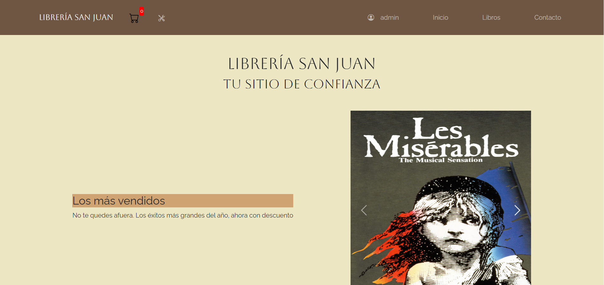
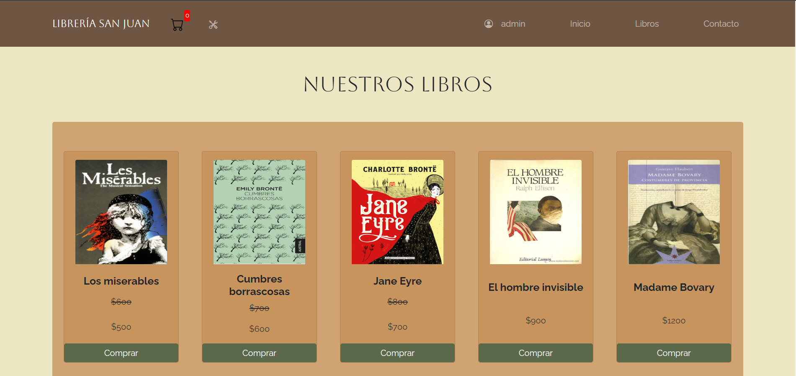
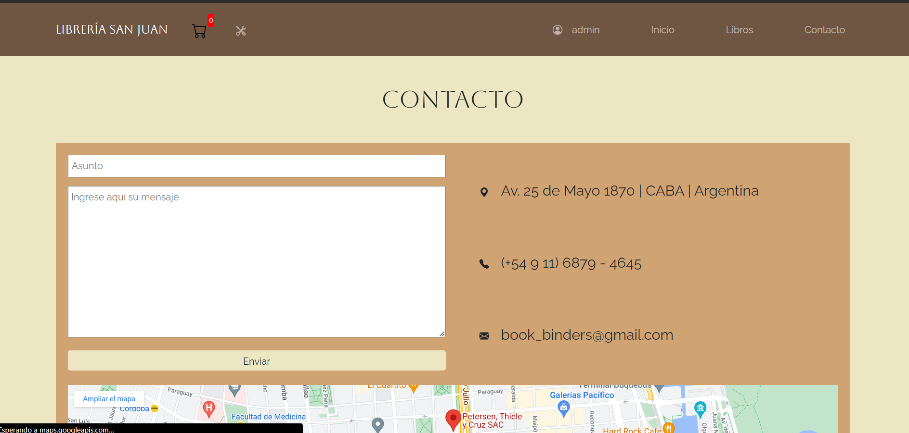
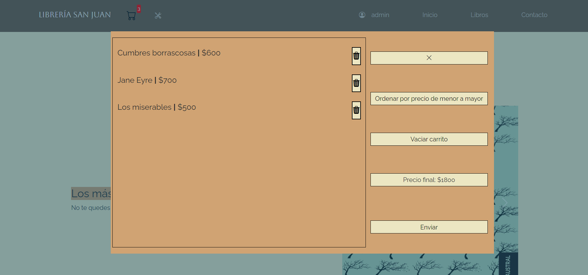
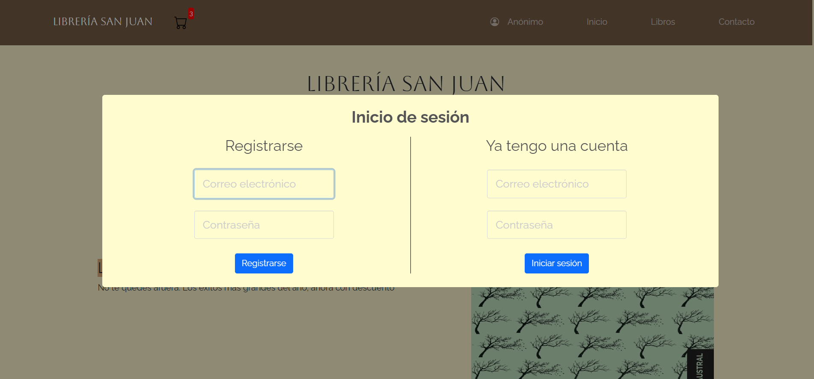
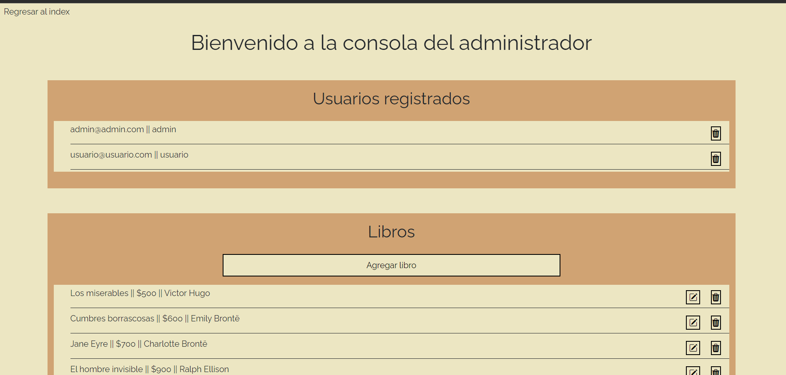

# Librería San Juan

## Proyecto para Academ-IT - ASJ Servicios

Para correr:

1. Ejecute "npx json-server --watch db.json"
2. Abra el archivo index.html. Se recomienda no utilizar live server, ya que no se complementa bien con json-server
3. Puede crearse una cuenta para probar interfaz de registro, así como el carrito de compra
4. Para probar el CRUD de libros inicie sesión como admin@admin.com. La contraseña es admin. Verá un nuevo ícono en el navbar con forma de herramientas. Haga click allí

